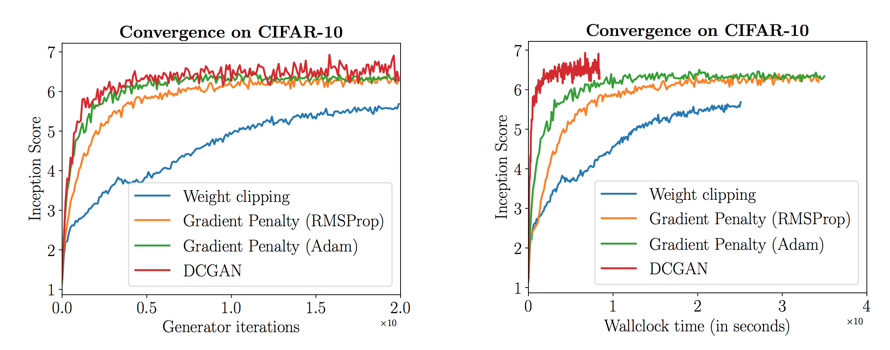
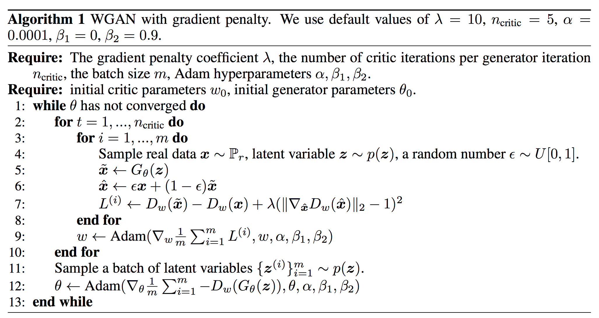
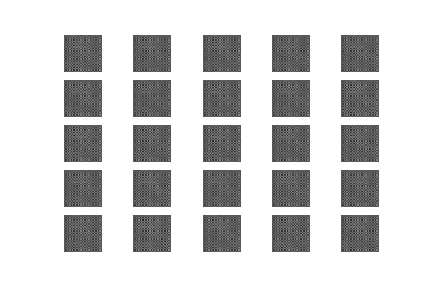
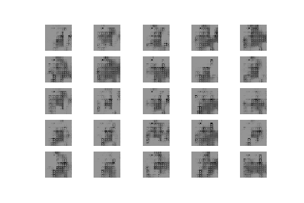
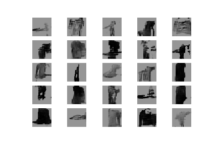
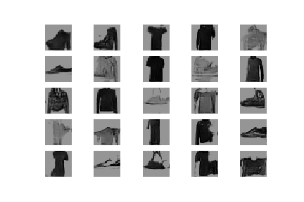
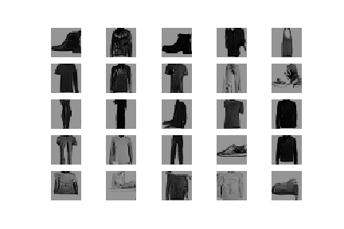
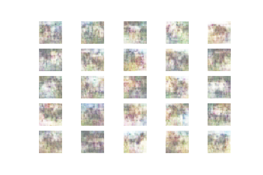
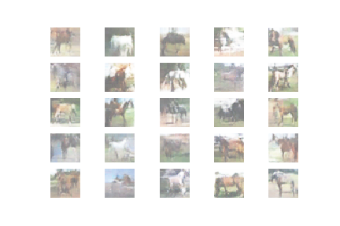
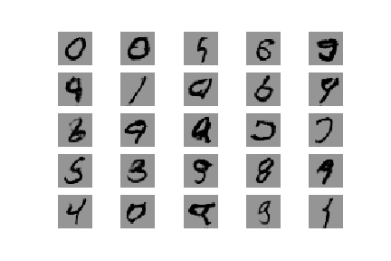

## Wasserstein Generative Adversarial Networks with Gradient Penalty (WGAN-GP)

[Paper: Improved Training of Wasserstein GANS](https://arxiv.org/abs/1704.00028)

Generative adversarial network (GAN) has shown great results in many generative tasks to replicate the real-world rich content such as images, human language, and music. It is inspired by game theory: two models, a generator and a discriminator, are competing with each other while making each other stronger at the same time. However, it is rather challenging to train a GAN model, as people are facing issues like training instability or failure to converge.

The recently proposed [Wasserstein GAN (WGAN)](https://arxiv.org/abs/1701.07875) makes progress toward stable training of GANs, but sometimes can still generate
only poor samples or fail to converge. The author proves that these problems are often due to the use of weight clipping in WGAN to enforce a Lipschitz constraint on the critic, which can lead to undesired behavior.

In this paper, they propose an alternative to clipping weights: penalize the norm of gradient of the critic with respect to its input. The proposed method performs better than standard WGAN and enables stable training of a wide variety of GAN architectures with almost no hyperparameter tuning.

You can find my WGAN repository [here](https://github.com/Mohammad-Rahmdel/WassersteinGAN-Tensorflow).

Clipping allows us to enforce the Lipschitz constraint on the critic’s model to calculate the Wasserstein distance. However, weight clipping isn't a good way to enforce a Lipschitz constraint. It behaves as a weight regulation. It reduces the capacity of the model and limits the capability to model complex functions.  If the clipping parameter is large, then it can take a long time for any weights to reach their limit, thereby making it harder to train the critic till optimality. If the clipping is small, this can easily lead to vanishing gradients when the number of layers is big, or batch normalization is not used (such as in RNNs).

WGAN-GP uses gradient penalty instead of the weight clipping to enforce the Lipschitz constraint.

### Gradient penalty ### 
A differentiable function f is 1-Lipschitz if and only if it has gradients with norm at most 1 everywhere.
So instead of applying clipping, WGAN-GP penalizes the model if the gradient norm moves away from its target norm value 1.

​​  

The major advantage of WGAN-GP is its convergency. It makes training more stable and therefore easier to train. As WGAN-GP helps models to converge better, we can use a more complex model like a deep ResNet for the generator and the discriminator.

​​  

### Algorithm ### 

​​  

## Tensorflow2 Implementation 

I used three different datasets for WGAN-GP. [MNIST](https://github.com/Mohammad-Rahmdel/WassersteinGAN-GradientPenalty-Tensorflow/blob/master/WGAN-GP_MNIST-horse.ipynb), [CIFAR10-horse class](https://github.com/Mohammad-Rahmdel/WassersteinGAN-GradientPenalty-Tensorflow/blob/master/WGAN-GP_Cifar10-horse.ipynb), and [Fashion_MNIST](https://github.com/Mohammad-Rahmdel/WassersteinGAN-GradientPenalty-Tensorflow/blob/master/WGAN-GP_fashionMNIST.ipynb).

### Results ### 

<table align='center'>
 <tr align='center'>
<td> Fashion MNIST samples during training </td>
<td> Cifar10 horse samples during training </td>
</tr>
<tr align='center'>
<td> 
<td> 
</tr>
</table>

    Generated samples for MNIST-fashion during training 

<table align='center'>
<tr align='center'>
<td> epoch 10  </td>
<td> epoch 60  </td>
</tr>	
<tr align='center'>
<td> 
<td> 
</tr>
<tr align='center'>
<td> epoch 150  </td>
<td> epoch 350  </td>
</tr>	
<tr align='center'>
<td> 
<td> 
</tr>
</table>

    Generated samples for horse images during training 

<table align='center'>
<tr align='center'>
<td> epoch 1  </td>
<td> epoch 600  </td>
</tr>	
<tr align='center'>
<td> 
<td> 
</tr>
</table>

    Generator's outputs after 60 epochs for MNIST

    

You can find more generated samples [here](https://github.com/Mohammad-Rahmdel/WassersteinGAN-GradientPenalty-Tensorflow/tree/master/results).

